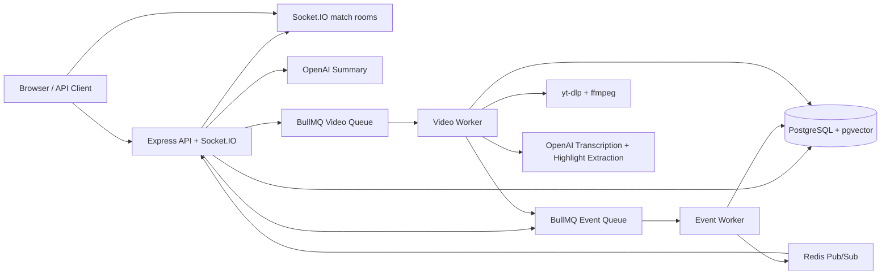
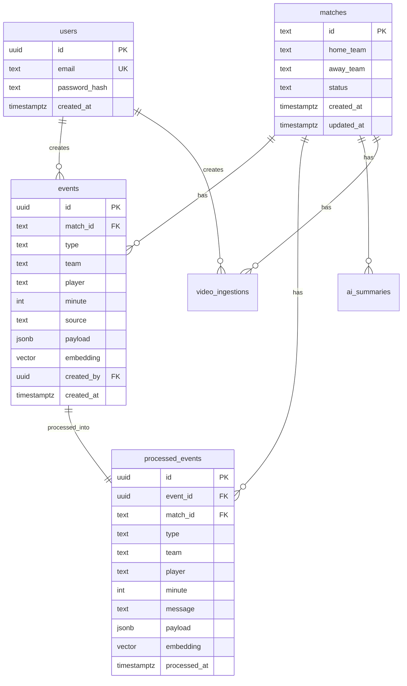

# ShotMob Real-Time Sports Event Engine

This is a 4-6 hour technical-test backend built with Node.js, TypeScript, PostgreSQL, pgvector, Redis, BullMQ, Socket.IO, JWT auth and OpenAI.

## Features

- JWT register/login
- `POST /events` stores raw match events, queues processing and broadcasts raw events
- `GET /events/:matchId` returns raw and processed timeline
- BullMQ worker validates/processes events, writes `processed_events`, retries failures and sends failures to DLQ
- Socket.IO rooms: `match:<matchId>`
- Redis Socket.IO adapter for multi-instance broadcasting
- AI summary endpoint with OpenAI
- Optional YouTube ingestion: downloads audio with `yt-dlp`, transcribes with OpenAI, extracts highlights and queues them as events
- PostgreSQL schema with pgvector-ready embedding columns and HNSW indexes

## Architecture



## ERD



## Local setup

```bash
cp .env.example .env
npm install
docker compose up -d
npm run migrate
npm run dev
```

Open: `http://localhost:4000`

## YouTube ingestion setup

Install `yt-dlp` and `ffmpeg` locally before using `/youtube/ingest`.

macOS:

```bash
brew install yt-dlp ffmpeg
```

Ubuntu:

```bash
sudo apt update
sudo apt install -y ffmpeg python3-pip
python3 -m pip install -U yt-dlp
```

Use only videos you are allowed to process.

## API examples

### Register

```bash
curl -X POST http://localhost:4000/auth/register \
  -H "Content-Type: application/json" \
  -d '{"email":"demo@example.com","password":"password123"}'
```

### Login

```bash
TOKEN=$(curl -s -X POST http://localhost:4000/auth/login \
  -H "Content-Type: application/json" \
  -d '{"email":"demo@example.com","password":"password123"}' | jq -r '.data.accessToken')
```

### Create event

```bash
curl -X POST http://localhost:4000/events \
  -H "Content-Type: application/json" \
  -H "Authorization: Bearer $TOKEN" \
  -d '{
    "matchId":"123",
    "type":"goal",
    "team":"home",
    "player":"John Doe",
    "minute":42,
    "payload":{"description":"A powerful finish into the bottom corner"}
  }'
```

### Get events

```bash
curl -H "Authorization: Bearer $TOKEN" http://localhost:4000/events/123
```

### AI summary

```bash
curl -X POST http://localhost:4000/ai/summary \
  -H "Content-Type: application/json" \
  -H "Authorization: Bearer $TOKEN" \
  -d '{"matchId":"123"}'
```

### YouTube ingestion

```bash
curl -X POST http://localhost:4000/youtube/ingest \
  -H "Content-Type: application/json" \
  -H "Authorization: Bearer $TOKEN" \
  -d '{"matchId":"123","youtubeUrl":"https://www.youtube.com/watch?v=VIDEO_ID"}'
```

## Deployment recommendation

Vercel is good for the frontend/demo page, but the full backend needs a long-running process for Socket.IO and BullMQ workers. Deploy the API and workers on Render, Railway, Fly.io, or EC2. Use Neon/Supabase for Postgres and Upstash/Redis Cloud for Redis.

Suggested production processes:

- Web service: `npm run start`
- Event worker: `npm run worker:event`
- Video worker: `npm run worker:video`

## What I would improve with more time

- Add OpenTelemetry tracing
- Add idempotency keys for event ingestion
- Add webhook partner delivery with retry signatures
- Add full Jest integration tests with Testcontainers
- Add role-based auth for event producers vs viewers
- Add chunked transcript processing for long videos
- Add cache invalidation for summaries
